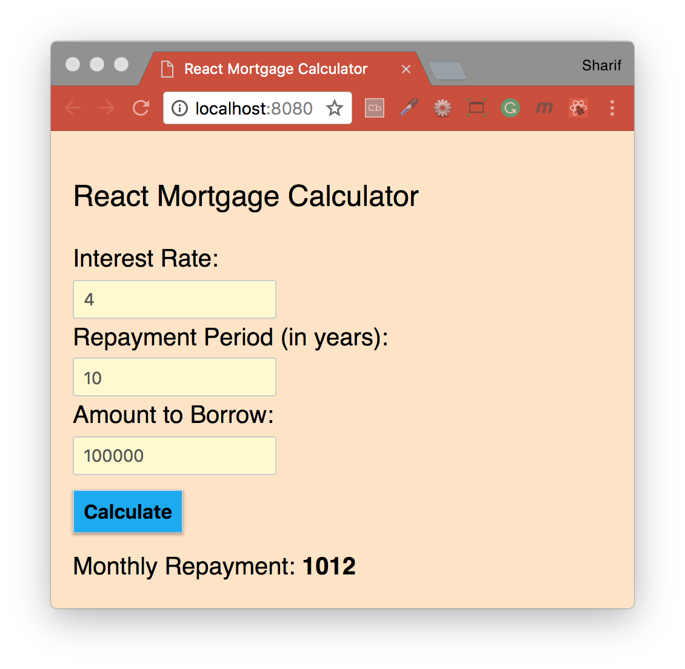

## React Bootstrap - Mortgage Calculator

Bootstrap React project, building a Mortgage Calculator, ES6 Class Syntax, Stateful React Components, setState(), Event Handlers.
 

#### Installation
To run this project you will need to download it onto your local machine and install all dependencies.
Navigate inside the folder and install all dependencies by entering the following command on your terminal window:
```
npm install
```
Finally to run the server enter the following command in your terminal window:
```
npm start
```
This will run the server, open [http://localhost:8080](http://localhost:8080) to view it in the browser. If you make any changes and save the changes process will automatically refresh and you will be able to see the results in the browser.

If you want to end the process hold `control` and press `c` in mac, if you are not using mac hold `ctrl` and press `c`.

#### Built with
* [npm](https://www.npmjs.com/) - Node Package Manager
* [React](https://www.npmjs.com/package/react) - An npm package to get you immediate access to React
* [React DOM](https://www.npmjs.com/package/react-dom) - This package serves as the entry point of the DOM-related rendering paths
* [Prop Types](https://www.npmjs.com/package/prop-types) - Runtime type checking for React props and similar objects
* [RAF](https://www.npmjs.com/package/raf) - RequestAnimationFrame polyfill for node and the browser
